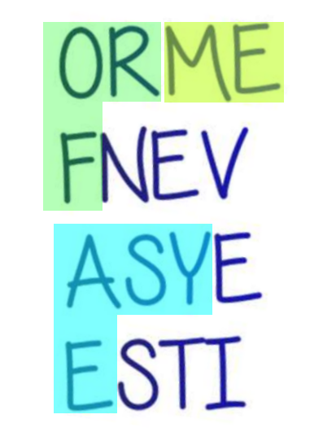

# Писатель: Write-up

Открываем [титульный лист](https://yadi.sk/i/C20qoHaI3Y92nM).

На нём сразу видим шифр. Как же его расшифровывать?

Сразу замечаем слова `easy`, `for`, `me`, постепенно понимаем, 
что текст нужно прочитать змейкой:

Флаг: **itseasyevenforme**
