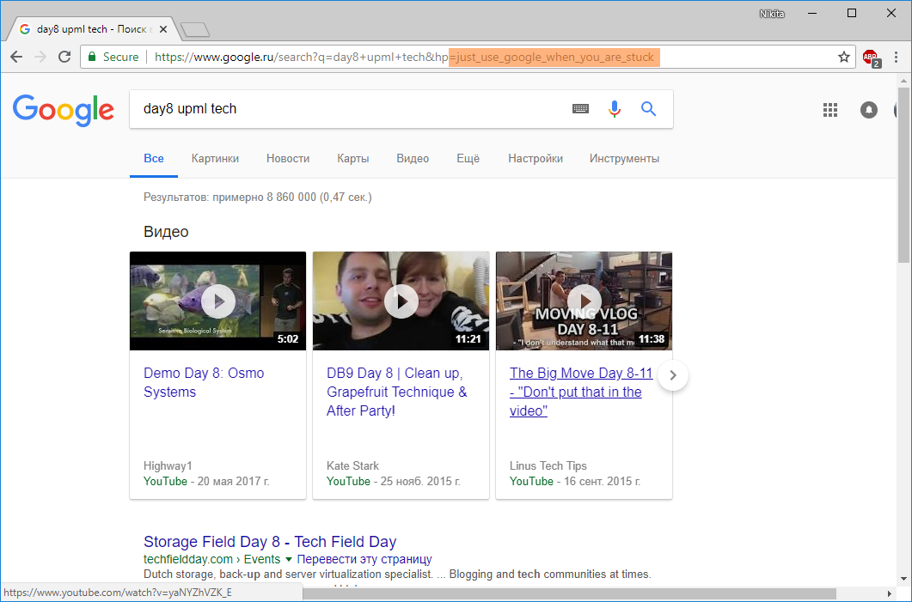

# Сломанный сайт: Write-up

Заходим на сайт и видим ошибку. Если бы мы зашли не с хрома, то сразу обнаружили бы, что страница поддельная, но большинство среднестатических пользователей открыли её в хроме и ничего не поняли.

В хроме также замечаем, что страница ненастоящая:

* Ошибка гласит `ERR_CONNECTION_REFUSED`, что дословно переводится как «Ошибка: в соединении отказано», однако, мы видим замочек около HTTPS в адресной строке, означающий, что HTTPS-сессия успешно установлена
* Мы можем посмотреть исходный код страницы в новой вкладке — для реально неработающих сайтов откроется та же самая страница

Сравниваем через инспектор элемента её и оригинал (открыв несуществующий сайт) и ищем отличия.

Обнаруживаем, что на нашей странице сильно меньше кода (вырезана игра с динозавриком и т.п.), но самое заметное — добавлен некая функция `Chromium__TrackSearch()`, которой нет в оригинале. На гугл есть и намек в условии:

> Но я не знаю, у кого спросить…

Зачем разбираться в скриптах? Скорее же тыкнем на ссылку. Попадаем в гугл, всё вроде бы нормально. Но флаг магическим образом «ждет» нас в адресной строке:

Флаг: **just_use_google_when_you_are_stuck**
