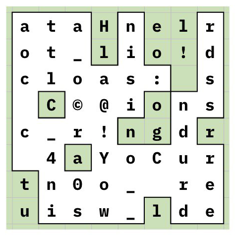

# Классика: Write-up

Открываем [картинку](public/grille.png) и видим известный шифр — [решетку Кардано](https://ru.wikipedia.org/wiki/%D0%A0%D0%B5%D1%88%D1%91%D1%82%D0%BA%D0%B0_%D0%9A%D0%B0%D1%80%D0%B4%D0%B0%D0%BD%D0%BE).

До этого можно было догадаться по юзернейму «специалиста» — `©@rd4n0.1501` — оно указывает на автора данного алгоритма — Джероламо Кардано, родившегося в 1501 году.

Берем решетку и накладываем на наши буквы:

*Картинка от @vanyaklimenko*

Выписываем из зеленых «окошек» буквы: `Hello! Congratul`

Поворачиваем решетку на 90 градусов и продолжаем процесс: но в какую сторону?

Попробуем по часовой стрелке — следующие 16 букв: `ations! Your rew`. Похоже на правду :)

Продолжаем процесс до конца и получаем флаг!

Дальше нужно аккуратно (со значком копирайта) заслать его в систему.

Флаг: **©@rd4n0_is_not_classic_code**
