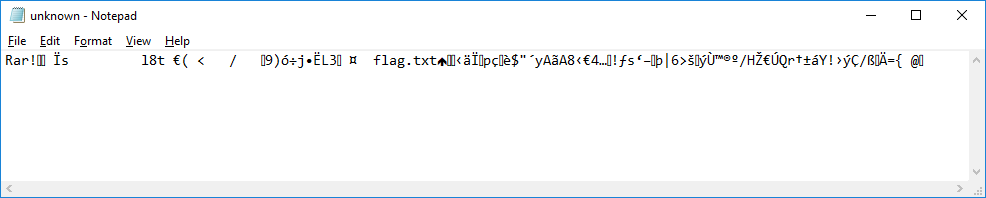
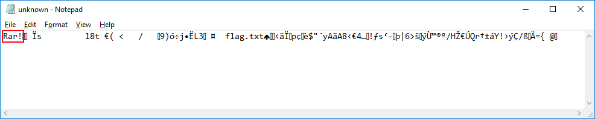

# Испорченный файл: Write-up

Даже если нет расширения, в чем же можно его открыть? А давайте в Блокноте.

Хм, какой-то мусор. Стоп: а что же это?

Не похоже на простую подсказку, верно? Действительно, у каждого файла есть [сигнатура](https://ru.wikipedia.org/wiki/%D0%A1%D0%BF%D0%B8%D1%81%D0%BE%D0%BA_%D1%81%D0%B8%D0%B3%D0%BD%D0%B0%D1%82%D1%83%D1%80_%D1%84%D0%B0%D0%B9%D0%BB%D0%BE%D0%B2) — стандартный набор байтов в начале файла, который позволяет сказать, что внутри, не зная расширения.

У rar-файлов всё довольно просто — сигнатура этих файлов — `Rar!`.

Смело переименовываем файл в `unknown.rar`, открываем и видим файл с флагом.

Флаг: **summer_bytes_can_say_anything**
