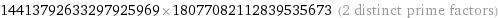

# Больше RSA: Write-up

В этом таске нужно расшифровать **самое настоящее RSA**.

Что ж, давайте узнаем, [как оно работает](https://ru.wikipedia.org/wiki/RSA#%D0%90%D0%BB%D0%B3%D0%BE%D1%80%D0%B8%D1%82%D0%BC_%D1%81%D0%BE%D0%B7%D0%B4%D0%B0%D0%BD%D0%B8%D1%8F_%D0%BE%D1%82%D0%BA%D1%80%D1%8B%D1%82%D0%BE%D0%B3%D0%BE_%D0%B8_%D1%81%D0%B5%D0%BA%D1%80%D0%B5%D1%82%D0%BD%D0%BE%D0%B3%D0%BE_%D0%BA%D0%BB%D1%8E%D1%87%D0%B5%D0%B9).

1. Берутся два простых числа *p* и *q*
2. Модуль — число *n* = *pq*
3. Вычисляется [функция Эйлера](https://ru.wikipedia.org/wiki/%D0%A4%D1%83%D0%BD%D0%BA%D1%86%D0%B8%D1%8F_%D0%AD%D0%B9%D0%BB%D0%B5%D1%80%D0%B0) от *n*, равная φ(*n*) = (*p* – 1) × (*q* – 1)
4. Берется *e*, меньшее φ(*n*) и взаимно простое с ним
5. Берется *d* такое, что *de* ≡ 1 (mod φ(*n*)) (оно называется *обратным мультипликативным*)

Открытый ключ — пара (*n*, *e*), закрытый — (*n*, *d*).

Тогда число *x* шифруется так: *y* = pow(*x*, *e*) (mod *n*), а число *y* расшифровывается так: *x* = pow(*y*, *d*) (mod *n*). Удивительно, но это действительно обратные операции.

Итак, у нас есть публичный ключ и зашифрованный текст. Для расшифровки нам нужно *d* из приватного ключа.

В чём сложность его вычислить? В том, что мы не знаем делителей *n*. Давайте попробуем найти его простые сомножители — *p* и *q* — вдруг у нас получится. Тогда мы сможем легко вычислить *d*, как в [Light RSA](../lightrsa/), и всё получится.

Такая процедура называется [факторизацией](https://ru.wikipedia.org/wiki/%D0%A4%D0%B0%D0%BA%D1%82%D0%BE%D1%80%D0%B8%D0%B7%D0%B0%D1%86%D0%B8%D1%8F_%D1%86%D0%B5%D0%BB%D1%8B%D1%85_%D1%87%D0%B8%D1%81%D0%B5%D0%BB).

Если мы напишем свою программу, то скорее всего, она будет работать за корень из *n*, а это долго — порядка квинтиллиона операций — миллиард секунд на процессоре с частотой 1 ГГц.

*Как быстрее?* В статье на Википедии приведено много экспоненциальных и субэкспоненциальных алгоритмов, работающих быстрее. Разумеется, **очень быстро** раскладывать числа никто не умеет — иначе RSA было бы неинтересным.

Но из статьи про RSA можно узнать, что ключ выбирают длиной 2048 бит — а у нас *n* порядка 2 в 128 степени (т.е. 128 бит). Значит, скорее всего, его можно разложить как-нибудь.

Поищем в интернете хорошие инструменты, а лучше вспомним про [вольфрам](http://wolframalpha.com/). Вводим `factorize 260559312989568206199788383015888592137` и получаем результат за секунды:

Далее вычисляем φ: `260559312989568206167297508269751130496`, с помощью того же вольфрама обратное мультипликативное *d*: `260559312989568206167297508269751130496`, возводим *y* в степень по модулю и получаем число `9224954329264882828446423741281`

Переводим в шестнадцатеричную систему: `746f6f5f736d616c6c5f727361`, переводим [hex to ascii](https://www.asciitohex.com/) и получаем флаг.

Флаг: **too_small_rsa**
