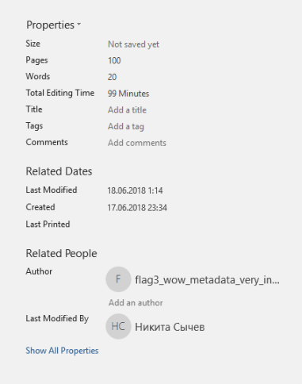

# Word: Meta: Write-up

[Reader](../word1/) | [Invisible](../word2/) | **Meta** | [Figure](../word4/) | [С чем поиграть](../word5/) | [Template](../word6/) | [Corrupt](../word7/)

Снова обращаем внимание на название таска. Намек на метаданные файла. Подумаем, что же к ним может относиться:
дата создания, размер, редактор, имя автора, версии…

Давайте смотреть: для начала просто откроем вкладку «Информация» в Ворде.

О, флаг!

Флаг: **flag3_wow_metadata_very_interesting**
