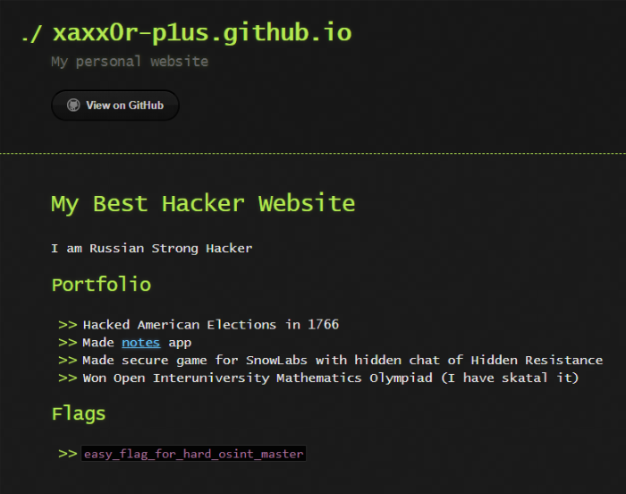

# Приключения Петра: Write-up

Пожалуй, это один из самых сложных тасков нашего квеста. В данном таске требовались навыки
поиска данных в открытых источниках.

Петр Пывнер, упоминаемый в данном таске, уже известный персонаж — он встречался на Ugra CTF
(надеемся, что нам надоест, и мы больше не будем делать про него таски).

Но, в отличие от Ugra CTF, у вас нет ничего, кроме имени и фамилии. Что же делать? Давайте
поищем в **социальных сетях**. Начнем с ВКонтакте. Открываем [поиск](https://vk.com/people/Петр+Пывнер) 
и видим, что такой человек лишь один.

Открываем и видим, что по всей видимости это именно тот, кто нам нужен.

Однако, сколько не листай его страницу, флагов найти не получится — их просто там нет. Даже номер карточки
есть, а флага нет. В поле «Сайт» ничего нет, тоже грустно.

Но наверняка ты сам используешь один и тот же юзернейм на разных сайтах. А что, если Пётр тоже так делает?
Для проверки этой догадки есть специальный [сервис](https://namechk.com). Вводим туда `xaxx0rl1v3` (часть
ссылки на страницу Петра после `https://vk.com/`). И, неожиданно, находим аккаунт Петра в Twitter:

На его странице тоже ничего интересного, все посты сделаны в апреле. Однако, среди них есть ссылка на один
из проектов Петра на Гитхабе. Это довольно простой сайт с заметками, но мы не можем узнать, где он расположен.

Посмотрим, что ещё он выложил на GitHub. И, как оказалось, у него есть ещё один репозиторий — 
`xaxx0r-p1us.github.io`. Вроде внутри ничего нет, но, если зайти на этот сайт, то на главной 
странице мы обнаружим флаг.

*Мораль*: о любом человеке можно найти много информации, если постараться.

Флаг: **easy_flag_for_hard_osint_master**
